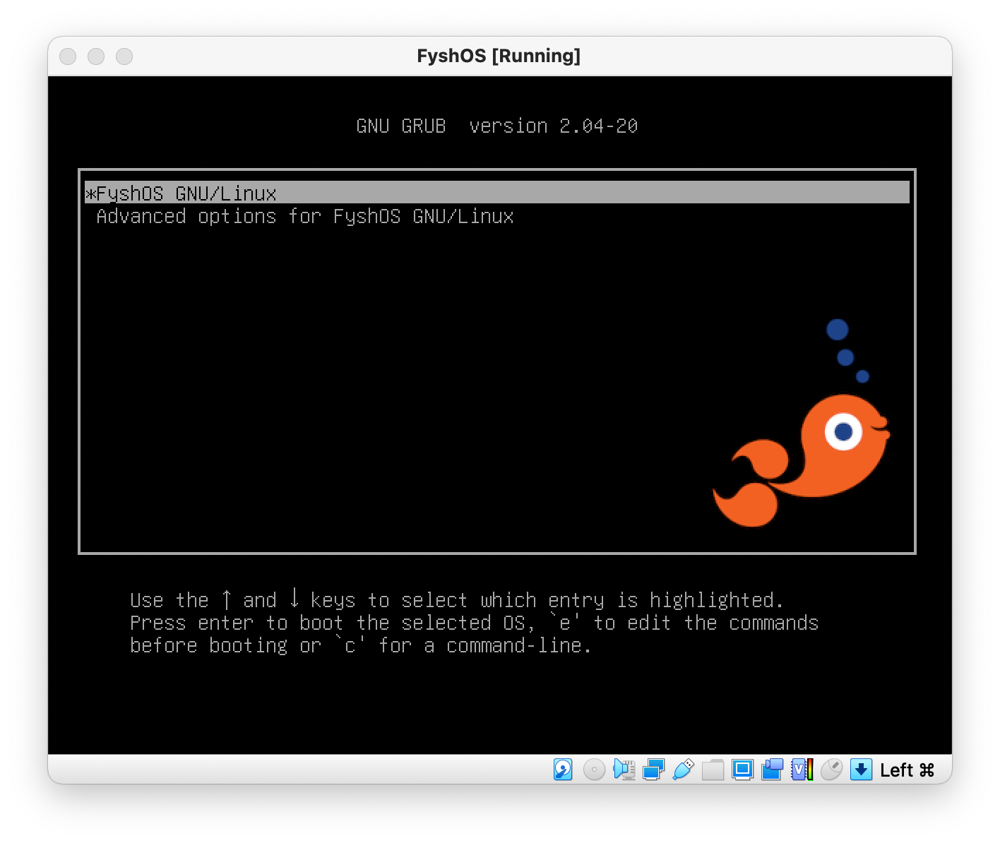

# FyshOS

## Building

On a debian system (bullseye or later):

```
$ sudo apt-get install live-build
$ sudo lb clean
$ lb config --debian-installer-gui=true --debian-installer=live -d stable --debian-installer-distribution stable
$ sudo lb build
```

The resulting live-image-amd64.hybrid.iso file is your FyshOS live system
and installer.

## Boot



